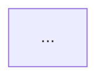

# Template — spec principal

Arquivo: `<dir>/<ISSUE>-<slug>.md`. Omita subseções não aplicáveis dizendo "não aplicável — <motivo>" em vez de preencher por obrigação.

```markdown
# <ISSUE> — <título>

## Objetivo
<uma frase com o resultado esperado>

## Contexto e decisões
- Origem: issue fornecida pelo usuário (<data/versão, se informada>).
- Comportamento atual: <descrição com caminhos/símbolos verificados>.
- Decisões confirmadas: D1 <decisão> (Q<n>) · D2 …
- Critérios de aceite:
  - CA1 <original da issue> …
  - CA4 <complementar, aprovado na entrevista (Q<n>)> …

## Fora do escopo
- …

## Premissas e riscos
| # | Descrição | Evidência/motivo | Impacto | Validação/mitigação | Situação |
|---|---|---|---|---|---|
| P1 | … | … | … | … | confirmado / premissa / pendente |

## Arquitetura da solução

### Visão geral
Componentes e responsabilidades · limites (módulos/camadas/serviços/externos) · interfaces e contratos · fluxo de dados e controle · o que muda vs. atual · justificativa e trade-offs · aderência aos padrões do repositório.
Quando pertinente: persistência e transações · sync/async · erros, retries, timeouts, idempotência · authn/authz e dados sensíveis · observabilidade e compatibilidade.
Marque cada elemento como **existente**, **alterado** ou **proposto**.

### Diagrama arquitetural <!-- conforme proporcionalidade -->


### Fluxograma <!-- conforme proporcionalidade -->


### Jornada (usuário e/ou aplicação) <!-- conforme proporcionalidade -->
Quem inicia · resultado pretendido · ações/respostas observáveis (humano) ou gatilho/participantes/processamento/resultado (job/serviço).
```mermaid
sequenceDiagram
  ...
```

### Rastreabilidade
| CA | Decisão/fluxo | Task(s) |
|---|---|---|
| CA1 | … | T1, T2 |
Dúvidas arquiteturais pendentes: … | Mermaid: validado com <ferramenta> / sintaxe não validada.

## Arquivos impactados
- [alterar] `path/existente.ext` — <finalidade>
- [criar] `path/novo.ext` — <finalidade>
(inclua testes e docs)

## Tasks
| Task | Título | Status | Depende de | Arquivo |
|---|---|---|---|---|
| T1 | … | ⬜ pendente | nenhuma | [T1](./<ISSUE>-T1-<slug>.md) |

## Verificação final
- Comandos (ordem do projeto): `<cmd>` em `<dir>` — pré-requisitos: …
- Verificações manuais: … | não aplicável
- Matriz: | CA | Task(s) | Evidência esperada |
- Checklist de convenções: …

## Decisões
<!-- preenchido pelo dev-mage durante a implementação -->
```

Durante o planejamento, descreva **evidências esperadas**; nunca apresente verificação futura como resultado obtido.
